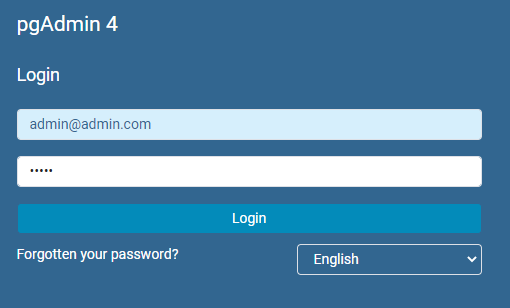
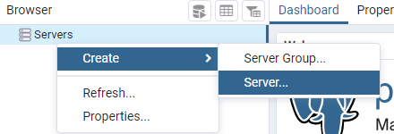
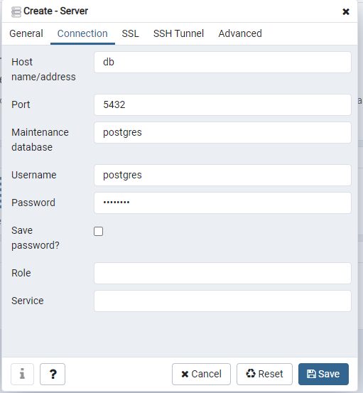

# RUN
Install docker and docker-compose
Run the two docker commands
- `docker-compose up -d`
- `docker exec -it miniprojekt_1_db_1 /bin/bash /home/setup_db.sh`

## setup pgadmin
goto `http://localhost:8080/`
- login
  - username: admin@admin.com
  - password: admin
  - 
- add db
  - 
  - 
    - host: db
    - database: postgres
    - username: postgres
    - password: postgres