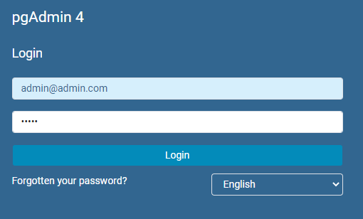
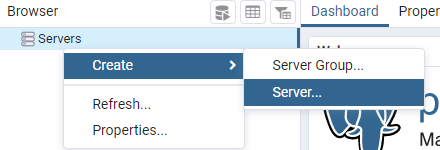
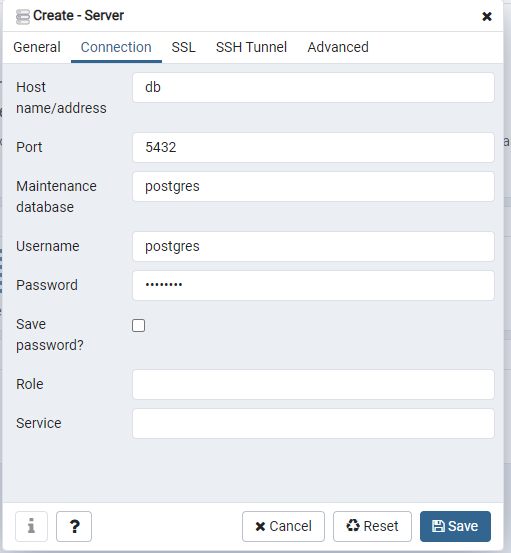

# RUN
- install docker
- `docker-compose up -d`
- `docker exec -it self_study_db_db_1 /bin/bash /home/setup_db.sh`

Now the database and a instance of pgadming is running in a vm in the background.
You can use pgadmin or something like datagrip to connect to the database.

The Ip and username is
  - server_ip: localhost
  - username: postgres
  - password: postgres
## pgadmin
To use pgadmin, go to `http://localhost:8080/` and follow the steps below
- login
  - username: admin@admin.com
  - password: admin
  - 
- connect to db
  - 
  - login
    - host: db
    - username: postgres
    - password: postgres
  - 
  
